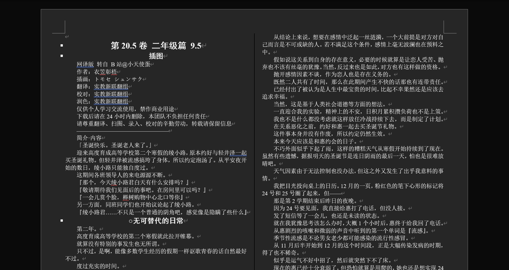

# Novel

小说爬虫



## 使用的语言

Kotlin

## 使用的库

- Selenium
- JSoup
- Kotlin Serialization
- Log4j
- Apache POI

## 使用方式

1. 获取小说信息

```kotlin
// top.bilitianx.network.PersistKt
fun persistJSON(id: Int, filename: String)
```

- `id`：小说的ID
- `filename`：JSON保存的路径

> **温馨提示：有的章节url为“javascript:cid()”，需手动修改**

运行结果示例：

```json5
{
  "id": 8,
  "name": "欢迎来到实力至上主义的教室",
  "volumes": [
    {
      "name": "第一卷",
      "chapters": [
        {
          "name": "插图",
          "url": "https://www.linovelib.com/novel/8/114783.html"
        },
        // ......
      ]
    }
    // ......
  ]
}
```


2. 爬取为Word文档

```kotlin
// top.bilitianx.network.PersistKt
fun persistMSWord(filename: String)
```

- `filename`：小说的JSON路径